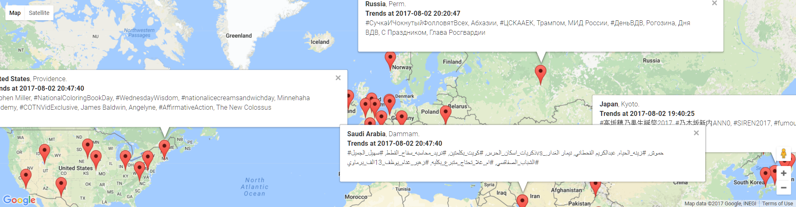

# TwitterTrends
This **streaming project** obtains current **Twitter's trending topic** and show them in **Google Maps** like this:




The project consists in the next 4 processes (each of one is a [Jupyter Notebook](http://jupyter.org/)). Here's a brief description, we can find detailed info inside each notebook:

- **[TwitterTrends-1-TrendsToFile](jupyter/TwitterTrends-1-TrendsToFile.ipynb)** (Scala): It obtains trending topic with twitter4j's methods: [getAvailableTrends](http://twitter4j.org/javadoc/twitter4j/api/TrendsResources.html#getAvailableTrends--) (return locations with trending topics) and [getPlaceTrends](http://twitter4j.org/javadoc/twitter4j/api/TrendsResources.html#getPlaceTrends-int-) (returns the top 10 trending topics for a specific location) and save all info into a file.
- **[TwitterTrends-2-FileToKafka](jupyter/TwitterTrends-2-FileToKafka.ipynb)** (Scala): It streams trending topic from a file to a Kafka topic using Spark Structured Streaming.
- **[TwitterTrends-3-KafkaToMongoDB](jupyter/TwitterTrends-3-KafkaToMongoDB.ipynb)** (Scala): It streams trending topic from a Kafka topic to MongoDB using Spark Structured Streaming.
- **[TwitterTrends-4-MongoDBtoGMaps](jupyter/TwitterTrends-4-MongoDBtoGMaps.ipynb)** (Python): It visualizes trending topic obtained from MongoDB into Google Maps.


### Requirements
- [Oracle JDK 1.8](http://www.oracle.com/technetwork/java/javase/downloads/jdk8-downloads-2133151.html) (64 bit).
- [Scala 2.11](https://www.scala-lang.org/download/2.11.11.html).
- [Apache Spark 2.2.0](https://spark.apache.org/downloads.html).
- [Apache Kafka 0.11.00 for Scala 2.11](https://www.apache.org/dyn/closer.cgi?path=/kafka/0.11.0.0/kafka_2.11-0.11.0.0.tgz).
- [Generate our own Twitter Tokens](https://dev.twitter.com/oauth/overview/application-owner-access-tokens).
- [Python 3](https://www.python.org/downloads/) and [Gmaps plugin](https://github.com/pbugnion/gmaps) for trending topics visualization.


### Starting Kafka and MongoDB servers
In order to run [TwitterTrends-2-FileToKafka](jupyter/TwitterTrends-2-FileToKafka.ipynb) we need to start Kafka server. For [TwitterTrends-3-KafkaToMongoDB](jupyter/TwitterTrends-3-KafkaToMongoDB.ipynb) we need to start Kafka server and MongoDB server.

Here's some indications about how to do it:

#### Starting Kafka server
First we need to add Kafka binaries directory in our system PATH and execute the next commands on kafka directory: 

1) Start ZooKeeper instance:
`zookeeper-server-start.bat config/zookeeper.properties`
2) Start the Kafka server
`kafka-server-start.bat config/server.properties`
3) Create a topic (*first run only*):
`kafka-topics.bat --create --zookeeper localhost:2181 --replication-factor 1 --partitions 1 --topic tweeterTopic`

We can see detailed explanation as well as the Unix commands in [Kafka Quickstart](https://kafka.apache.org/quickstart).


#### Starting MongoDB server
We need to add MongoDB binaries directory in our system PATH and to type `mongod` in a command line.

Once started, If we want to use a GUI for MongoDB, we can use [MongoDB Compass](https://www.mongodb.com/products/compass).


### Some things to consider
1) [Jupyter Scala](https://github.com/jupyter-scala/jupyter-scala): Scala kernel for Jupyter.

    There's no need to use Jupyter (we can use our favourite Scala development environment) but in order to explain the project in a more interactive way I prefer to use it.
    
    If we plan to use Jupyter Scala we have to take in mind that the way to **manage dependences** (adding external libraries) differs from Jupyter Scala Notebook to a standard Scala IDE/Intellij IDEA with the use of [SBT](http://www.scala-sbt.org/) (Simple Build Tool). For example:
    
    In a standard Scala IDE/Intellij IDEA with the use of SBT we manage libraries adding the next line into our build.sbt file:
    ```Scala
    libraryDependencies += "org.apache.spark" %% "spark-sql" % "2.2.0"
    ```
    
    In Scala Jupyter Notebook we manage libraries executing the next statement in the notebook:	 
    ```Scala
    import $ivy.`org.apache.spark::spark-sql`:2.2.0
    ```

    In either case we need to load the libraries as we normally do, for example: `import org.apache.spark`

___

2) **Spark's logging level**: By default when creating the Spark Session it will show all logging level (even INFO). In order to change this we can set our desired logging level.

    In order to do this we have to copy and rename the *log4j.properties.template* included in our spark/conf folder to spark/conf/log4j.properties and change the following:
    
    `log4j.rootCategory=INFO, console`
    
    to
    
    `log4j.rootCategory=WARN, console`
    
    Now we can import log4j library and set our properties file. For example:
    ``` Scala
    import org.apache.log4j.PropertyConfigurator
    PropertyConfigurator.configure("C:/spark/conf/log4j.properties")
    ```


### Pending tasks
- Implementing Structured Streaming from Kafka to MongoDB [when supported](https://jira.mongodb.org/browse/SPARK-85).
- Filtering by continent ([\$geoIntersects](https://docs.mongodb.com/manual/reference/operator/query/geoIntersects/#op._S_geoIntersects) with MongoDB).
